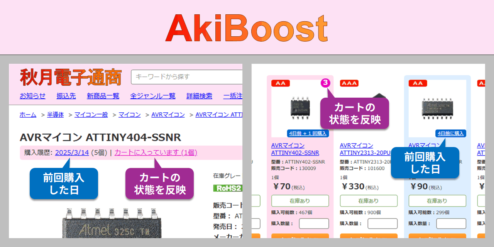

# Aki Boost

秋月電子通商のウェブサイトに機能を追加して、より便利に使えるようにします。

- 過去に購入した商品 (購入履歴に含まれる商品) を強調表示します。
- カートに既に入っている商品を強調表示します。
- 最近カートに入れた商品をもう一度まとめてカートに入れることができます。
- 購入履歴の表に各商品ページへのリンクを設定します。

## インストール方法

1. Chrome または Firefox に以下のいずれかの拡張機能をインストールします。
    - [Tampermonkey](https://www.tampermonkey.net/) (Chrome/Firefox)
    - [Violentmonkey](https://violentmonkey.github.io/) (Firefox)
    - [Greasemonkey](https://addons.mozilla.org/ja/firefox/addon/greasemonkey/) (Firefox)
2. Chrome + Tampermonkey の場合は [デベロッパーモードを有効化](https://www.google.com/search?q=Chrome+%E3%83%87%E3%83%99%E3%83%AD%E3%83%83%E3%83%91%E3%83%BC%E3%83%A2%E3%83%BC%E3%83%89+%E6%9C%89%E5%8A%B9%E5%8C%96) します。
3. [こちらのリンク](https://github.com/shapoco/aki-boost/raw/refs/heads/main/dist/aki-boost.user.js) を開き、ユーザースクリプトをインストールします。

## 購入履歴の読み込み

1. 秋月電子のアカウントにログインします。
2. ページ左下の Aki Boost ボタンをクリックしてメニューを開きます。
3. 「購入履歴を更新」→「開始」をクリックして購入履歴を読み込みます。

## 安全性について

- 購入履歴とカートの状態は拡張機能の設定データとしてブラウザに保存され、秋月電子からログアウトした後も保持されます。
- 秋月電子へのログインに必要な情報 (ユーザ名、パスワード、セッション ID やその他の Cookie など) は参照しません。
- 保存されたデータの安全性はブラウザと拡張機能の安全性に準じます。

## 免責事項

Aki Boost が表示する購入履歴の内容やカートの状態は、過去に取得または閲覧されたページの内容に基づくものであり、最新の情報が正確に反映されていることを保証するものではありません。表示内容に誤りがあった場合でも、作者はその責任を負いません。

注文を確定する前に、カートの内容が正しいかどうかを必ずご自身でご確認ください。

## 動作がおかしくなったら

メニューの「データベースをリセット」を実施した後、再度購入履歴を読み込んでみてください。

----
