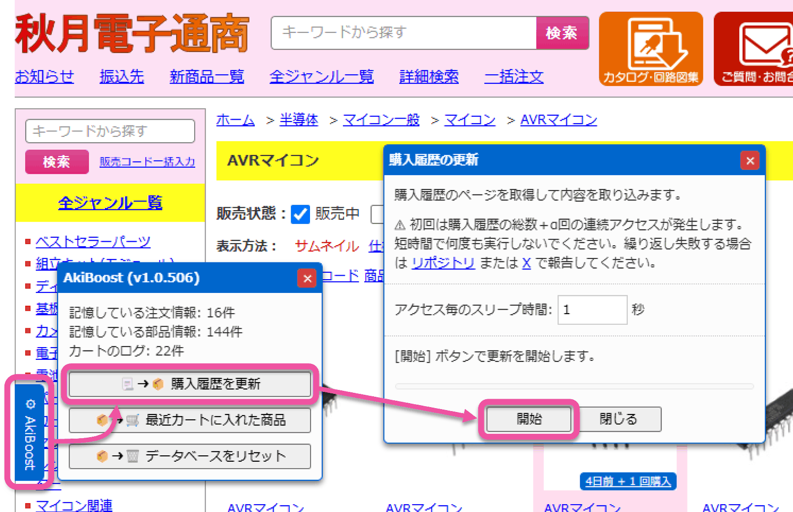

# AkiBoost

秋月電子通商のウェブサイトに機能を追加して、より便利に使えるようにする UserScript です。

- 過去 (※1) 購入した商品を強調表示します。
- カートに既に入っている商品を強調表示します。
- 最近カートに入れたことがある商品を一覧し、再度まとめてカートに入れることができます。
- 購入履歴の表に各商品ページへのリンクを設定します。

※1) 2023 年 1 月以前の購入履歴は 2024 年の秋月電子のリニューアル時に削除されたため反映されません。

## インストール方法

1. Chrome または Firefox に以下のいずれかの拡張機能をインストールします。
    - [Tampermonkey](https://www.tampermonkey.net/) (Chrome/Firefox)
    - [Violentmonkey](https://violentmonkey.github.io/) (Firefox)
    - [Greasemonkey](https://addons.mozilla.org/ja/firefox/addon/greasemonkey/) (Firefox)
2. Chrome + Tampermonkey の場合は [デベロッパーモードを有効化](https://www.google.com/search?q=Chrome+%E3%83%87%E3%83%99%E3%83%AD%E3%83%83%E3%83%91%E3%83%BC%E3%83%A2%E3%83%BC%E3%83%89+%E6%9C%89%E5%8A%B9%E5%8C%96) します。
3. [こちらのリンク](https://github.com/shapoco/aki-boost/raw/refs/heads/main/dist/aki-boost.user.js) を開き、ユーザースクリプトをインストールします。
4. インストールが完了したら「購入履歴の取り込み」を実施してください。

## 購入履歴の取り込み

初回は以下の手順で購入履歴を AkiBoost に取り込みます。

1. 秋月電子のアカウントにログインします。
2. ページ左下の AkiBoost ボタンをクリックしてメニューを開きます。
3. 「購入履歴を更新」→「開始」をクリックして購入履歴を取り込みます。

新しい購入履歴も上記手順で取り込めますが、単に当該購入履歴の詳細ページを開くだけでも自動的に取り込まれます。

## データの安全性について

- AkiBoost が取得したデータ (購入履歴やカートの状態など) は拡張機能の設定データとしてブラウザに保存され、秋月電子からログアウトした後も保持されます。AkiBoost 自体にはそれらを第三者へ送信する機能はありません。
- 保存されたデータの安全性はブラウザと拡張機能の安全性に準じます。
- 秋月電子のログインに関する情報 (ユーザ名、パスワード、ログインセッションの情報など) は参照も保存もしません。

## 免責事項

AkiBoost が表示する購入履歴の内容やカートの状態は、過去に取得または閲覧したページの内容に基づくものであり、常に最新の情報が正確に反映されていることを保証するものではありません。表示内容に誤りがあった場合でも、作者はその責任を負いません。

注文を確定する前に、カートの内容が正しいかどうかを必ずご自身でご確認ください。

## 動作がおかしくなったら

メニューの「データベースをリセット」を実施した後、再度購入履歴を読み込んでみてください。

----
